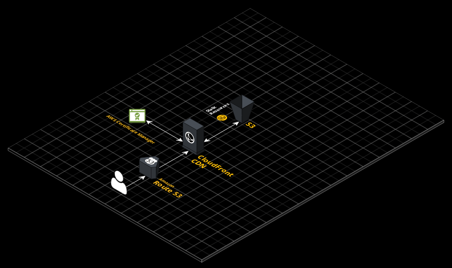

# IaC Cloudfront + s3 with different account and alternate domain
Terraform project that creates an S3 bucket and a cloudfront distribution to serve content from that bucket (from different accounts) with alternate domain support

Feel free to check the end result [here](https://cloudfront.muhnagy.com) or [here (cloudfront url)](https://d3mymmddqx0v3n.cloudfront.net)

## Setup

1. Clone this repo.

2. Install `awscli`:
   ```sh
    brew install awscli  # OS X
    apt install awscli   # Ubuntu
    ```

3. Create AWS connection profiles:
   ```
   s3
   cloudfront
   ```

   Example for `cloudfront`:
   ```
   aws configure --profile cloudfront

     AWS Access Key ID [None]: YOURACCESSKEY
     AWS Secret Access Key [None]: YOURSECRETKEY
     Default region name [None]: us-east-1
     Default output format [None]: json
   ```
4. run `terraform init`

## Assumptions 
You need to have 2 profiles configured for aws `cloudfront` and `s3`which has access to cloudfront and s3 respectively.

It assumes you have your domain hosted in Route 53 on the same account as cloudfront account

This was made with the assumption that it will be used on empty AWS accounts therefore it creates all the resources it needs (except the Route 53 zone since the user need to create it and either host the domain on AWS or point the domain name nameservers to Route 53)
## How to use
1. Make sure that you have 2 profiles in `~/.aws/credentials` one called cloudfront and the other called s3
2. Make sure that your cloudfront account has a route 53 zone for the domain name you would like to use.
3. Update `terraform.tfvars` as needed, if you provide alternate domain then you must also provide certificate ARN otherwise it will be ignored and no alternate domain will be used.
4. run `terraform plan` to check execution plan and if all is good then proceed
5. run `terraform apply` and then write yes
6. Execution will display cloudfront distribution domain name at the end, please wait 5 - 10 minutes while CF distribution gets deployed.
7. If you have configured alternate domain name, Please configure a CNAME record to point to CloudFront Distribution domain
8. :tada:

## Structure 
1. `include` Contains static files, in this case only 1 file 
2. `modules` Includes current project modules
   1. `aws-cloudfront` A module to create cloudfront distribution & CF origin identity to be used with s3
   2. `aws-s3` A module to create s3 bucket, grant access to the bucket to CF origin identity and upload index file in `include` in the root of the project
   3. `aws-acm` A module to create ACM certificate.
   4. `aws-r53-record` A module to create route 53 dns record
3. `main.tf` Calls modules to create cloudfront distribution & s3 bucket
4. `outputs.tf` Defines cloudfront distribution domain name output
5. `providers.tf` Defines aws providers for different AWS profiles
6. `variables.tf` Defines variables
7. `versions.tf` Defines required provider and version
8. `terraform.tfvars` contains values for variables

## Architecture
Users open the website which is managed by Route 53.

They would be served  with the cloudfront distribution which uses a certificate generated by ACM.

The content will be served from the S3 bucket from the other account.

## What to improve
There wasn't a lot of details on how it should look like, but I would
1. Add a lot more variables to the modules to make it more reusable in different scenarios, but I figured no need to do that unless a case comes up
